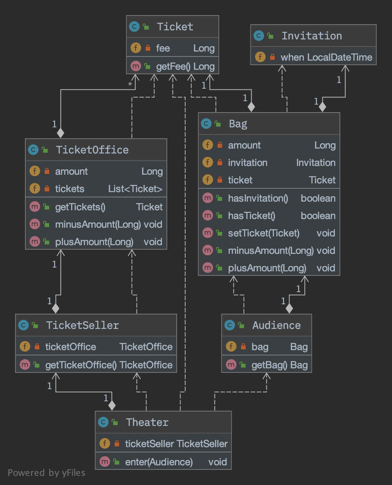
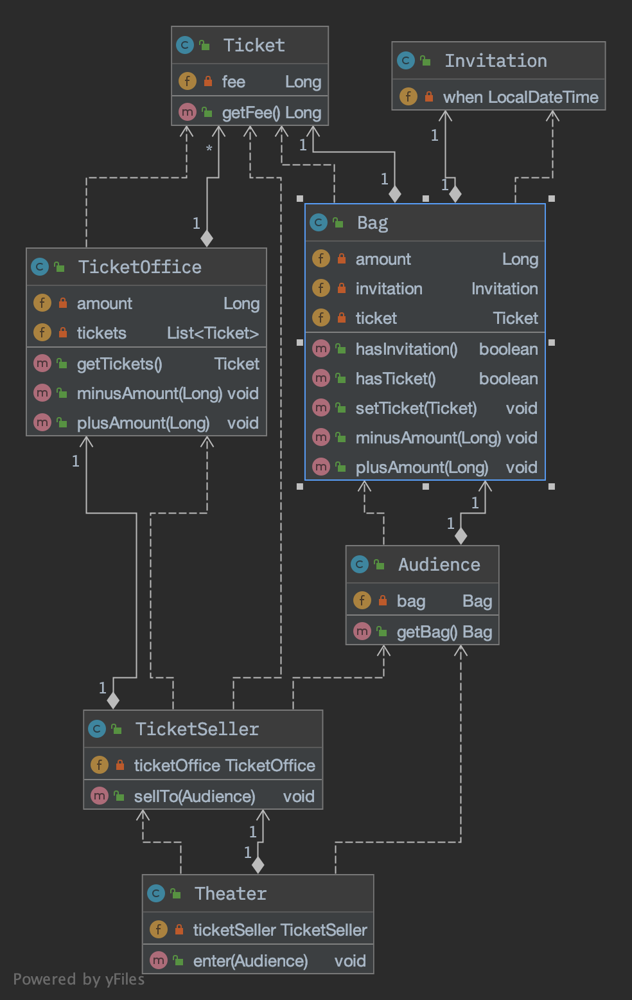
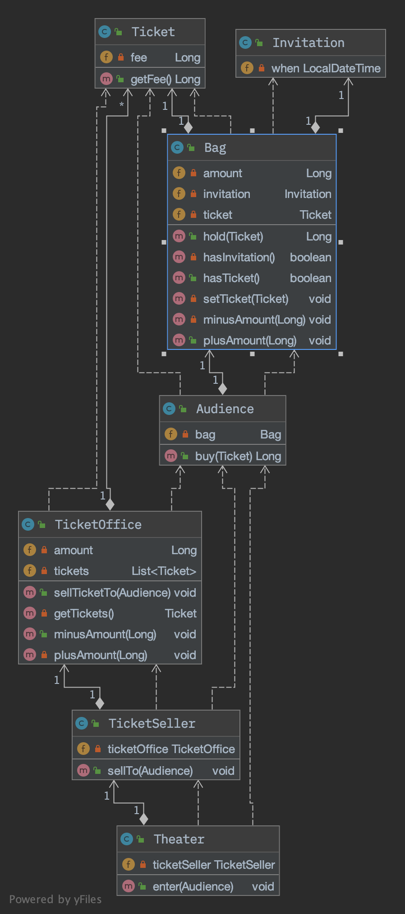

# Chapter01 객체, 설계

로버트 L. 글래스(Robert L. Glass)는 <i><소프트웨어 크리에이티비티 2.0>[Glass06a]</i> 에서 '이론 대 실무'라는 흥미로운 주제에 관한 개인적인 견해를 밝히고 있다.  글래스의 결론을 한마디로 요약하면 이론보다 실무가 먼저라는 것이다.

소프트웨어 개발에서 실무가 이론보다 앞서 있는 대표적인 분야로 '소프트웨어 설계'와 '소프트웨어 유지보수'를 들 수 있다. 소프트웨어의 규모가 커지면 커질수록 소프트웨어 설계 분야에서 이론이 실무를 추월할 가능성은 희박해 보인다. 실무에서는 다양한 규모의 소프트웨어를 성공적으로 유지보수하고 있지만 소프트웨어 유지보수와 관련된 효과적인 이론이 발표된 적은 거의 없다.

결론적으로 소프트웨어 설계와 유지보수에 중점을 두려면 이론이 아닌 실무에 초점을 맞추는 것이 효과적이다.

이 책에서는 객체지향 패러다임을 설명하기 위해 추상적인 개념이나 이론을 앞세우지 않을 것이다. 가능하면 개발자인 우리가 가장 잘 이해할 수 있고 가장 능숙하게 다룰 수 있는 코드를 이용해 객체지향의 다양한 측면을 설명하려고 노력할 것이다.

---

### 01 티켓 판매 애플리케이션 구현하기

#### 조건

- 소극장 경영하고 있다는 가정
- 공연을 무료로 관람할 수 있는 초대장
- 이벤트 당첨자들과 표를 구매하려는 관람객
    - 이벤트에 당첨된 관람객은 초대장을 티켓으로 교환한 후에 입장
    - 이벤트에 당첨되지 않은 관람객은 티켓을 구매해야만 입장

 

#### 코드
- [Invitation(초대장)](../ObjectsExampleCode/src/main/java/com/wooklab/example/chapter01/Invitation.java)
- [Ticket(티켓)](../ObjectsExampleCode/src/main/java/com/wooklab/example/chapter01/Ticket.java)
- [Bag(가방)](../ObjectsExampleCode/src/main/java/com/wooklab/example/chapter01/Bag.java)
- [Audience(관람객)](../ObjectsExampleCode/src/main/java/com/wooklab/example/chapter01/Audience.java)
- [TicketOffice(매표소)](../ObjectsExampleCode/src/main/java/com/wooklab/example/chapter01/TicketOffice.java)
- [TicketSeller(판매원)](../ObjectsExampleCode/src/main/java/com/wooklab/example/chapter01/TicketSeller.java)
- [Theater(소극장)](../ObjectsExampleCode/src/main/java/com/wooklab/example/chapter01/Theater.java)

 

#### [ 초기 애플리케이션 클래스 다이어그램 ]

---

### 02 무엇이 문제인가

로버트 마틴(Robert C. Martin)은 <클린 소프트웨어: 애자일 원칙과 패턴, 그리고 실천방법>[Martin2002a]에서 소프트웨어 모듈(크기와 상관 없이 클래스나 패키지, 라이브러리와 같이 프로그램을 구성하는 임의의 요소)이 가져야 하는 세가지 기능에 관해 설명한다.
> 소프트웨어 모듈의 목적
> 1. 실행 중에 제대로 동작하는 것
> 2. 변경을 위해 존재하는 것
> 3. 코드를 읽는 사람과 의사소통하는 것

 

#### 예상을 빗나가는 코드

이해 가능한 코드란 그 동작이 우리의 예상에서 크게 벗어나지 않는 코드다. 초기에 작성된 코드는 우리의 상식과 다르게 동작하고 코드를 이해하기 위해 여러 가지 세부적인 내용들을 한꺼번에 기억하고 있어야 하기 때문에 코드를 읽는 사람과 제대로 의사소통하지 못한다. 하지만 가장 심각한 문제는 변경이 필요한 경우 많은 여러 클래스를 동시에 변경해야 한다는 것이다.

 

#### 변경에 취약한 코드

의존성(dependency)이라는 말 속에는 어떤 객체가 변경될 때 그 객체에게 의존하는 다른 객체도 함께 변경될 수 있다는 사실이 내포되어 있다. 

- 결합도(coupling)
    - 결합도가 높다: 객체 사이의 의존성이 강한 경우
    - 결합도가 낮다: 객체들이 합리적인 수준으로 의존할 경우

따라서 객체지향 설계의 목표는 객체 사이의 결합도를 낮춰 변경이 용이한 설계는 만드는 것이다.

---

### 03 설계 개선하기

초기의 기능은 제대로 수행하지만 이해하기 어렵고 변경하기 쉽지 않은 코드를 객체를 
자율적인 존재로 만드는 것으로 개선할 수 있다.

#### 자율성을 높이자

자율성을 높이기 위해 외부에서 마음대로 접근할 수 없도록 캡슐화(encapsulation)를 하자. 개념적이나 물리적으로 객체 내부의 세부적인 사항을 감추는 것을 캡슐화라고 하며, 내부로의 접근을 제한하면 객체와 객체 사이의 결합도를 낮출 수 있기 때문에 변경하기 쉬운 객체를 만들 수 있다.

 

#### [ 개선된 애플리케이션 클래스 다이어그램 ]

(개선1차: TicketSeller의 캡슐화)

(개선2차: Audience의 캡슐화)

 

#### 무엇이 개선됐는가

스스로 자율적인 존재가 된 객체는 내부 구현을 변경하더라도 다른 객체를 함께 변경할 필요가 없다.

 

#### 어떻게 한 것인가

자기 자신의 문제를 스스로 해결하도록 코드를 변경한 것이다.

 

#### 캡슐화와 응집도

핵심은 객체 내부의 상태를 캡슐화하고 객체 간에 오직 메시지를 통해서만 상호작용하도록 만드는 것이다.

- 응집도(cohesion)가 높다: 밀접하게 연관된 작업만 수행하고 연관성 없는 작업은 다른 객체에게 위임하는 객체를 가리키는 말.
    - 객체의 응집도를 높이기 위해서 => 객체 스스로 자신의 데이터를 책임져야 한다.

 

### 절차지향과 객체지향

- 절차적 프로그래밍(Procedural Programming)
    - 프로세스와 데이터를 별도의 모듈에 위치시키는 방식
    - 우리의 예상을 쉽게 벗어나기 때문에 코드를 읽는 사람과 원활하게 소통하지 못함
    - 변경하기 어려운 코드를 양산하는 경향이 있음
- 객체지향 프로그래밍(Object-Oriented Programming)
    - 데이터와 프로세스가 동일한 모듈 내부에위치하도록 프로그래밍 하는 방식
    - 자신의 문제를 스스로 처리해야 한다는 우리의 예상을 만족시켜주기 때문에 이해하기 쉬움
    - 객체 내부의 변경이 객체 외부에 파급되지 않도록 제어할 수 있기 때무에 변경하기 수월함

 

#### 책임(객체의 기능)의 이동(shift of responsibility)

- 책임 집중: 절차적 프로그래밍 방식의 경우 한 객체에 책임이 집중되어 있다.
- 책임 이동: 객체지향 프로그래밍 방식의 경우 각 객체에 적절하게 책임이 분산되어 있다. 즉 한 객체에 몰려 있던 책임이 개별 객체로 이동한 것이다.

객체지향 애플리케이션은 스스로 책임을 수행하는 자율적인 객체들의 공동체를 구성함으로써 완성된다. 사실 객체지향 설계의 핵심은 적절한 객체에 적절한 책임을 할당하는 것이다. 따라서 객체가 어떤 데이터를 가지느냐보다는 객체에 어떤 책임을 할당할 것이냐에 초점을 맞춰야 한다.

불필요한 세부사항을 캡슐화하는 자율적인 객체들이 낮은 결합도와 높은 응집도를 가지고 협록하도록 최소한의 의존성만 남기는 것이 훌륭한 객체지향 설계이다.

 

#### 더 개선할 수 있다

- 낮은 결합도와 높은 응집도라는 것으로 모든 경우를 만족 시킬 수 없다.
- 훌륭한 설계는 적절한 트레이드오프의 결과물이며 균형의 예술이다.

 

#### [ 더 개선된 애플리케이션 클래스 다이어그램 ]

(개선3차: Bag의 캡슐화)

 

#### 그래, 거짓말이다!

객체지향의 세계가 우리가 세상을 바라보는 직관과 객체를 완전 일치한다는 것은 거짓말이다. 비록 현실에서는 수동적인 존재라고 하더라도 일단 객체지향의 세계에 들어오는 모든 것이 능동적이고 자율적인 존재로 바뀐다.

훌륭한 객체지향 설계란 소프트웨어를 구성하는 모든 객체들이 자율적으로 행동하는 설계를 가리킨다.

---

### 04 객체지향 설계

#### 설계가 왜 필요한가

좋은 설계란 오늘 요구하는 기능을 온전히 수행하면서 내일의 변경을 매끄럽게 수용할 수 있는 설계다. 이러한 설계는 코드를 변경할 때 버그가 추가될 가능성을 낮출 수 있다.

 

#### 객체지향 설계

훌륭한 객체지향 설계란 협력하는 개체 사이의 의존성을 적절하게 관리하는 설계다. 협력하는 객체들 사이의 의존성을 적절하게 조절함으로써 변경에 용이한 설계를 만들 수 있다.
