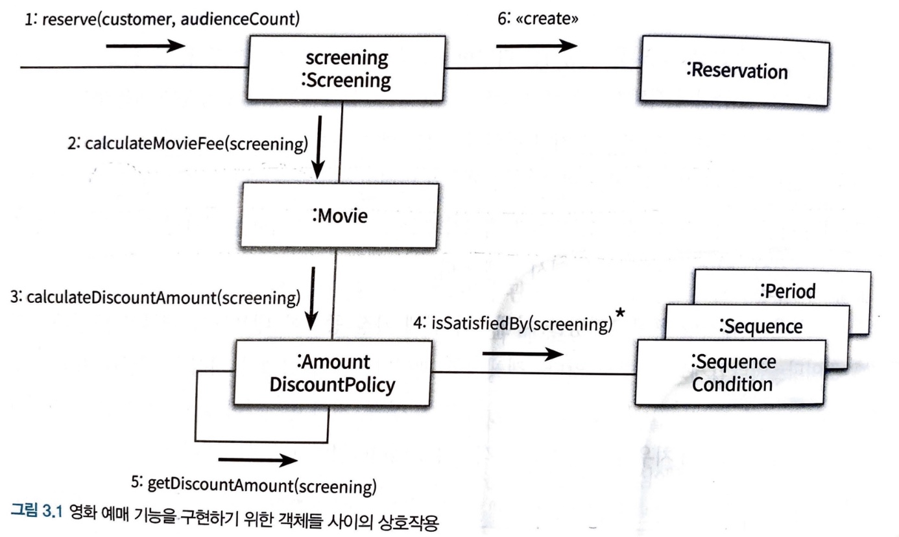

# Chapter03 역할, 책임, 협력

> **객체지향의 본질**은 협력하는 객체들의 공동체를 장조하는 것  
> **객체지향 설계의 핵심**은 협력을 구성하기 위해 적절한 객체를 찾고 적절한 책임을 할당하는 과정에서 드러남

---

### 01 협력

#### 영화 예매 시스템 돌아보기

- 객체지향 원칙을 따르는 애플리케이션의 **제어 흐름**은 어떤 하나의 객체에 의해 통제되지 않음
- 다양한 객체들 사이에 균형 있게 분배됨
- 즉 기능을 구현하기 위해 메시지를 주고 받으며 상호작용함

> 협력: 객체들이 애플리케이션의 기능을 구현하기 위해 수행하는 상호작용  
> 책임: 객체가 협력에 참여하기 위해 수행하는 로직  
> 역할: 객체들이 협력 안에서 수행하는 책임들이 모여, 객체가 수행하는 역할

 

#### 협력

- 객체지향 시스템: 자율적인 객체들의 공동체
- 객체: 시스템의 기능이라는 더 큰 목표를 달성하기 위해 다른 객체와 협력하는 사회적 존재
- 메시지 전송(message sending)과 메서드: 
    - **메시지는 전송**은 객체 사이의 협력을 위해 사용할 수 있는 유일한 커뮤니케이션 수단
    - 메시지를 수신한 객체는 **메서드**를 실행해 요청에 응답
    - 외부의 객체는 오직 메시지만 전송할 수 있고 메시지를 어떻게 처리할지는 메시지를 수신한 객체가 직접 결정
- 객체를 자율적으로 만드는 가장 기본적인 방법: 내부 구현을 캡슐화
- 자율적인 객체란 
    - 자신에게 할당된 책임을 수행하던 중에 외부의 도움이 필요한 경우 적절한 객체에게 메시지를 전송해서 협력을 요청
    - 메시지를 수신한 객체 역시 메시지를 처리하던 중에 직접 처리할 수 없는 정보나 행동이 필요한 경우 또 다른 객체에게 도움을 요청

 

#### 협력이 설계를 위한 문맥을 결정한다
- 객체가 협력에 참여할 수 있는 이유는 
    - 협력에 필요한 적절한 행동을 보유하고 있기 때문
- 객체의 행동을 결정하는 것은 
    - 객체가 참여하고 있는 협력
- 협력은 객체가 필요한 이유와 객체가 수행하는 행동의 동기를 제공
- 협력: 객체의 행동을 결정하는 것
- 행동: 객체의 상태를 결정하는 것
- 상태 -> 객체가 행동하는 데 필요한 정보에 의해 결정
- 행동 -> 협력 안에서 객체가 처리할 메시지로 결정
- 즉 객체가 참여하는 협력이 객체를 구성하는 행동과 상태를 모두 결정
- 따라서 협력은 객체를 설계하는 데 필요한 일종의 문맥(context)을 제공

---

### 02 책임

#### 책임이란 무엇인가

- 협력에 참여하기 위해 객체가 수행하는 행동
- 객체에 의해 정의도는 응집도 있는 해위의 집합
- 객체가 유지해야 하는 정보와 수행할 수 있는 행동에 대해 개략적을 서술한 문장
- 하는 것(doing)과 아는 것(knowing)
    - 객체의 책임은 객체가 '무엇을 알고 있는가'와 '무엇을 할 수 있는가'로 구성
    - 하는 것
        - 객체를 생성하거나 계산을 수행하는 등의 스스로 하는 것
        - 다른 객체의 행동을 시작 시키는 것
        - 다른 객체의 활동을 제어하고 조절하는 것
    - 아는 것
        - 사적인 정보에 관해 아는 것
        - 관련된 객체에 관해 아는 것
        - 자신이 유도하거나 계산할 수 있는 것에 관해 아는 것
- Screening과 Movie
    - Screening의 책임
        - 영화를 예매하는 것(doing)
        - 자신이 상영할 영화를 알고 있어야 함(knowing)
    - Movie의 책임
        - 요금을 계산하는 것(doing)
        - 가격과 어떤 할인 정책이 적용됐는지(knowing)

> 적절한 협력이 적절한 책임을 제공하고, 적절한 책임을 적절한 객체에게 할당해야만 단순하고 유연한 설계 가능

 

#### 책임 할당

- 객체는 협력에 필요한 지식과 방법을 가장 잘 알고 있는 객체에게 도움을 요청
- 요청에 응답하기 위해 필요한 이 행동이, 객체가 수행할 책임으로 이어지는 것
- 객체지향 설계는 협력에 필요한 메시지를 찾고 메시지에 적절한 객체를 선택하는 반복적인 과정
- 협력에 필요한 메시지가 메시지를 수신할 객체의 책임을 결정
- 메시지가 객체의 퍼블릭 인터페이스를 구성

 

#### 책임 주도 설계
- 협력을 설계하기 위해서는 책임에 초점을 맞춰야 함
- 책임을 찾고 책임을 수행할 적절한 객체를 찾아 책임을 할당하는 방식으로 협력을 설계하는 방법을 책임 주도 설계(Responsibility-Driven Design, RDD)라고 함
- 책임을 할당할 때 고려해야 하는 두 가지 요소
    - 메시지가 객체를 결정한다
    - 행동이 상태를 결정한다

 

#### 메시지가 객체를 결정한다

- 메시지를 먼저 식별하고 메시지를 처리할 객체를 나중에 선택했다는 것이 중요
- 메시지가 객체를 선택해야 하는 이유
    - 최소한의 인터페이스(minimal interface)를 가질 수 있게 된다
    - 충분히 추상적인 인터페이스(abstract interface)를 가질 수 있게 된다

 

#### 행동이 상태를 결정한다

- 객체가 존재하는 이유는 협력에 참여하기 위해서
- 객체는 협력에 필요한 행동을 제공
- 객체를 객체답게 만드는 것은 객체의 상태가 아니라 객체가 다른 객체에게 제공하는 행동
- 협력이 객체의 행동을 결정하고 행동이 상태를 결정 그리고 그 행동이 바로 객체의 책임

---

### 03 역할

#### 역할과 협력

- 역할
    - 객체가 어떤 특정한 협력 안에서 수행하는 책임의 집합
- 익명의 역할을 찾고 그 역할을 수행할 수 있는 객체를 선택하는 방식
    - *역할이 없어도 객체만으로 충분히 협력을 설계 할 수 있는 것 아닌가?*

 

#### 유연하고 재사용 가능한 협력

- 역할이 중요한 이유는 역할을 통해 유연하고 재사용 가능한 협력을 얻을 수 있기 때문
- AmountDiscountPolicy와 PercentDiscountPolicy 모두 할인 요금 계산이라는 동일한 책임을 수행
- 객체라는 존재를 지우고 할인 요금을 계산하라는 메시지에 응답할 수 있는 대표자를 생각한다면 두 협력을 하나로 통합 가능
    - 여기서 역할이 두 종류의 구체적인 객체를 포괄하는 추상화라는 점
    - 불필요한 중복코드 제거
- 책임과 역할을 중심으로 협력을 바라보는 것이 바로 변경과 확장이 용이한 유연한 설계로 나아가는 첫걸음
- 객체에게 중요한 것은 행동이며, 역할은 객체를 추상화해서 객체 자체가 아닌 협력에 초점을 맞추는 것

 

#### 객체 대 역할

- 역할은 객체가 참여할 수 있는 일종의 슬롯
- 협력에 적합한 책임을 수행하는 대상이 한 종류라면 간단하게 객체로 간주
- 만약 여러 종류의 객체들이 참여할 수 있다면 역할로 부름
- 도메인 모델 안에는 개념과 개체와 역할이 어지럽게 뒤섞여 있으며 이것은 사람들이 세계를 바라보는 일반적인 관점
- 설계 초반에는 적절한 책임과 협력의 큰 그림을 탐색하는 것이 가장 중요
- 애매하다면 단순하게 객체로 시작하고 반복적으로 책임과 협력을 정제해가면서 필요한 순간에 객체로부터 역할을 분리해내는 것이 가장 좋은 방법

 

#### 역할과 추상화

- 역할은 공토으이 책임을 바탕으로 객체의 종류를 숨기기 때문에 이런 관점에서 역할을 객체의 추상화로 불 수 있음
- 추상화의 장점
    1. 세부 사항에 억눌리지 않고도 상위 수준의 정책을 쉽고 간단하게 표현
        - 협력이라는 관점에서는 세부적인 사항을 무시하고 추상화에 집중하는 것이 유용
        - 객체 사이의 핵심적인 상호작용이 더 또렷하게 드러남
    2. 설계를 유연하게 만든다
        - 협력 안에서 역할이라는 추상화를 이용하면 기존 코드를 수정하지 않고도 새로운 행동을 추가 할 수 있음

 

#### 배우와 배역

> 연극에 참여하는 그 순간만큼은 배우들은 사라지고 배역만 남는다. 그러나 무대 막이 내리면 배역은 사라지고 다시 본래의 연극 배우로 돌아오게 된다.

- 배역과 배우 간의 관계
    - 배역은 연극 배우가 특정 연극에서 연기하는 역할
    - 배역은 연극이 상영되는 동안에만 존재하는 일시적인 개념
    - 연극이 끝나면 배우는 배역이라는 역할을 벗어 버리고 원래의 배우로 돌아옴
    - 동일한 배역을 여러 명의 배우들이 연기할 수 있음

- 역할과 객체 간의 관계
    - 객체는 다양한 역할을 가질 수 있음
    - 객체는 협력에 참여할 때 협력 안에서 하나의 역할로 보여짐
    - 객체가 다른 협력에 참여할 때는 다른 역할로 보여짐
    - 협력의 관점에서 동일한 역할을 수행하는 객체들은 서로 대체 가능
    - 역할은 특정한 객체의 종류를 캡슐화, 때문에 동일한 역할을 수행하고 계약을 준수하는 대체 가능한 객체들은 다형적인 특성

