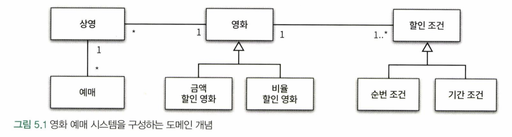

# 05 책임 할당하기
- 책임에 초점을 맞춰서 설계할 때 직면하는 가장 큰 어려움은 어떤 객체에게 어떤 책임을 할당할지를 결정하기가 쉽지 않다는 것
- 이번 장에서 살펴볼 GRASP 패턴은 책임 할당의 어려움을 해결하기 위한 답을 제시

---

### 01 책임 주도 설계를 향해

- `데이터 중심 설계 -> 책임 중심의 설계` 로 전환하기 위한 원칙
    1. 데이터보다 행동을 먼저 결정하라
    2. 협력이라는 문맥 안에서 책임을 결정하라

#### 데이터보다 행동을 먼저 결정하라

- 클라이언트의 관점에서 객체가 수행하는 행동이란 곧 객체의 책임을 의미
- 책임 중심의 설계에서는 "이 객체가 수행해야 하는 책임은 무엇인가"를 결정한 후에
- "이 책임을 수행하는 데 필요한 데이터는 무엇인가"를 결정
- 책임 중심의 설계에서는 객체의 행동, 즉 책임을 먼저 결정한 후에 객체의 상태를 결정

 

#### 협력이라는 문맥 안에서 책임을 결정하라

- 책임과 협력
    - 책임은 객체의 입장이 아니라 객체가 참여하는 협력에 적합해야 함
    - 메시지를 전송하는 클라이언트의 의도에 적합한 책임을 할당해야 함 
      (메시지 수신자가 아니라 메시지 전송자에게 적합한 책임)
    - 객체가 메시지를 선택하는 것이 아니라 메시지가 객체를 선택
- 메시지가 클라이언트의 의도를 표현한다
    - 객체를 결정하기 전에 객체가 수신할 메시지를 먼저 결정
    - 메시지를 수신하기로 결정된 객체는 메시지를 처리할 `'책임'`을 할당받음
- 메시지를 먼저 결정
    - 메시지 송신자는 메시지 수신자에 대한 어떠한 가정도 할 수 없음
    - 메시지 전송자의 관점에서 메시지 수신자가 깔끔하게 캡슐화 됨
- 책임 중심의 설계에서는 협력이라는 문맥 안에서 객체가 수행할 책임에 초점

 

#### 책임 주도 설계

> 책임 주도 설계의 흐름
> - 시스템이 사용자에게 제공해야 하는 기능인 시스템 책임 파악
> - 시스템 책임을 더 작은 책임으로 분할
> - 분할된 책임을 수행할 수 있는 적절한 객체 또는 역할을 찾아 책임 할당
> - 객체가 책임을 수행하는 도중 다른 객체의 도움이 필요한 경우 이를 책임질 적절한 객체 또는 역할을 찾음
> - 해당 객체 또는 역할에게 책임을 할당함으로써 두 객체가 협력

- 책임 주도 설계의 핵심은 책임을 결정한 후에 책임을 수행할 객체를 결정하는 것
- 협력에 참여하는 객체들의 책임이 어느 정도 정리될 때까지는 객체의 내부 상태에 대해 관심을 가지지 않는 것

---

### 02 책임 할당을 위한 GRASP 패턴

> GRASP 패턴 (General Responsibility Assignment Software Pattern, GRASP Pattern) 
> -크레이그 라만(Craig Larman)

#### 도메인 개념에서 출발하기
어떤 책임을 할당해야 할 때 가장 먼저 고민해야 하는 유력한 후보는 바로 도메인 개념

- 영화 예매 시스템을 구성하는 도메인 개념과 개념 사이의 관계를 대략적으로 표현
- 설게를 시작하기 위해 참고할 수 있는 개념들의 모음 정도로 간주
- 도메인 개념을 정리하는 데 너무 많은 시간을 들이지 말고 빠르게 설계와 구현을 진행하라
    - 도메인 모델이 `구현을 염두해 두고 구조화`되는 것이 바람직
    - 실제 코드를 구현하면서 얻게 되는 통찰이 역으로 도메인에 대한 개념을 바꾸기 때문

 

#### 정보 전문가에게 책임을 할당하라

- 제공해야 할 기능을 애플리케이션의 책임으로 본다
    - 이 책임을 애플리케이션에 대해 전송된 메시지로 간주하고 이 메시지를 책임질 첫 번째 객체를 선택하는 것으로 설계 시작
- 메시지를 전송할 객체는 무엇을 원하는가?
    - 메시지를 전송해야할 객체의 의도
- 메시지를 수신할 적합한 객체는 누구인가?
    - 메시지를 책임질 객체 선택하기
    
> 정보 전문가(Information Expert) 패턴
> - 객체의 책임과 책임을 수행하는 데 필요한 상태는 동일한 객체 안에 존재해야한다
> - 정보 전문가가 데이터를 반드시 저장하고 있을 필요는 없다 
   (책임을 수행하는 객체가 정보를 '알고' 있다고 해서 그 정보를 '저장'하고 있을 필요는 없다)

- 메시지 전송과 수신을 통해 협력 공동체 구성하기
    1. 메시지를 처리할 책임을 할당
    2. 메시지를 수신한 객체가 수행해야 하는 작업 흐름을 생각(필요한 절차와 구현 고민)
    3. 만약 스스로 처리할 수 없는 작업이라면 외부에 도움 요청(외부로 전송하는 새로운 메시지)
    4. 이 메시지가 새로운 객체의 책임을 할당

 

#### 높은 응집도와 낮은 결합도

> 낮은 결합도(Low Coupling) 패턴
> - 낮은 결합도는 모든 설계 결정에서 염두에 둬야 하는 원리

> 높은 결합도(High Cohesion) 패턴
> - 낮은 결합도처럼 높은 응집도 역시 모든 설계 결정에서 염두에 둬야 할 원리

- 설게는 트레이드오프, 높은 응집도와 낮은 결합도를 얻을 수 있는 설계 패턴이 있다면 그 설계를 선택해야 한다
- 책임을 할당하고 코드를 작성하는 매순간마다 낮은 결합도와 높은 응집도의 관점에서 전체적인 설계 품질을 검토하면 단순하면서도 재사용 가능하고 유연한 설계를 얻을 수 있다

 

#### 창조자에게 객체 생성 책임을 할당하라

> 창조자(Creator) 패턴
> - 책임 할당 패턴으로서 객체를 생성할 책임을 어떤 객체에게 할당하지에 대한 지침을 제공
> - 이미 존재하는 객체 사이의 관계를 이용, 때문에 낮은 결합도 설계 유지

---

### 03 구현을 통한 검증

- 전체 소스코드
    -  [Customer](../ObjectsExampleCode/src/main/java/com/wooklab/example/chapter05/Customer.java)
    -  [DiscountCondition](../ObjectsExampleCode/src/main/java/com/wooklab/example/chapter05/DiscountCondition.java)
    -  [DiscountConditionType](../ObjectsExampleCode/src/main/java/com/wooklab/example/chapter05/DiscountConditionType.java)
    -  [Money](../ObjectsExampleCode/src/main/java/com/wooklab/example/chapter05/Money.java)
    -  [Movie](../ObjectsExampleCode/src/main/java/com/wooklab/example/chapter05/Movie.java)
    -  [MovieType](../ObjectsExampleCode/src/main/java/com/wooklab/example/chapter05/MovieType.java)
    -  [Reservation](../ObjectsExampleCode/src/main/java/com/wooklab/example/chapter05/Reservation.java)
    -  [ReservationAgency](../ObjectsExampleCode/src/main/java/com/wooklab/example/chapter05/ReservationAgency.java)
    -  [Screening](../ObjectsExampleCode/src/main/java/com/wooklab/example/chapter05/Screening.java)

 

#### DiscountCondition 개선하기

- 변경에 취약한 클래스를 포함하고 있다
    - 변경에 취약한 클래스: 코드를 수정해야 하는 이유를 하나 이상 가지는 클래스
- 변경의 이유에 따라 클래스를 분리해야 한다

 

위험 징후를 또렷하게 드러내는 패턴
- 인스턴스 변수가 초기화 되는 시점 살펴보기
    - 응집도가 높은 클래스 = 인스턴스를 생성할 때 모든 속성을 초기화
    - 응집도가 낮은 클래스 = 객체의 속성 중 일부만 초기화
        - 즉 함께 초기화되는 속성을 기준으로 코드를 분리
- 메서드들이 인스턴스 변수를 사용하는 방식 살펴보기
    - 응집도 높음 = 모든 메서드가 객체의 모든 속성을 사용
    - 응집도 낮음 = 속성에 따라 그룹이 나뉨
        - 즉 속성 그룹과 해당 그룹에 접근하는 메서드 그룹을 기준으로 코드 분리

 

#### 타입 분리하기

- 두 개의 독립적인 타입이 하나의 클래스 안에 공존
- 두 개의 클래스로 분리 => 위험 징후들이 해결
- 그러나 클래스를 분리한 후에 설계의 관점에서 전체적인 결합도 증가
- 응집도가 높아졌지만 변경과 캡슐화라는 관점에서 보면 전체적으로 설계의 품질이 나빠질 수 있음

 

#### 다형성을 통해 분리하기

- 동일한 책임을 수행한다는 것은 동일한 역할을 수행한다는 것을 의미
- 역할의 개념을 적용하면 구체적인 클래스는 알지 못한 채 오직 역할에 대해서만 결합되도록 의존성을 제한할 수 있음
- 자바에서 역할 구현하기
    1. 추상클래스
        - 구현을 공유해야 할 필요가 있을 경우
    2. 인터페이스
        - 구현을 공유할 필요 없이 역할을 대체하는 객체들의 책임만 정의할 경우
- 객체의 암시적인 타입에 따라 행동을 분기해야 한다면
    - 암시적인 타입을 명시적인 클래스로 정의하고 행동을 나눔으로써 응집도 문제를 해결
    - 즉 객체의 타입에 따라 변하는 행동이 있다면 타입을 분리하고 변화하는 행동을 각 타입의 책임으로 할당
    - GRASP 에서는 이를 다형성(Polymorphism) 패턴이라 함

> 다형성(Polymorphism) 패턴
> - 조건적인 논리를 사용하지 말라고 경고
> - 대신 다형성을 이용해 새로운 변화를 다루기 쉽게 확장하라고 권고

 

#### 변경으로부터 보호하기

> 변경 보호(Protected Variations) 패턴
> - 변경을 캡슐화하도록 책임을 할당

- 설계의 결합도와 응집도를 향상시키는 방법
    - 클래스를 변경에 따라 분리하고 인터페이스를 이용해 변경을 캡슐화
    - 하나의 클래스가 여러 타입의 행동을 구현하면
        - 클래스를 분해하고 다형성 패턴에 따라 책임을 분산
    - 예측 가능한 변경으로 인해 여러 클래스르들이 불안정해진다면
        - 변경 보호 패턴에 따라 안정적인 인터페이스 뒤로 변경을 캡슐화

 

#### Movie 클래스 개선하기

- 책임을 중심으로 설계할 때 혜택
    - 모든 클래스의 내부 구현은 캐슐화
    - 모든 클래스는 변경의 이유를 오직 하나씩만 가짐
    - 각 클래스는 높은 응집도아 낮은 결합도
    - 클래스는 작고 오직 한 가지 일만 수행
    - 책임을 적절하게 분배

 

#### 변경과 유연성

- 개발자로서 변경을 대비할 수 있는 방법
    1. 코드를 이해하고 수정하기 쉽도록 최대한 단순하게 설계
    2. 코드를 수정하지 않고도 변경을 수용할 수 있도록 코드를 더 유연하게 만들기
- 대부분의 경우 1번이 좋은 방법, 변경이 반복적으로 발생한다면 2번이 좋은 방법
- 2번 즉 상속 대신 합성을 사용하기

> 책임 할당의 어려움을 느끼고 있다면
> - 일단 절차형 코드로 실행되는 프로그램을 빠르게 작성한 후 완성된 코드를 개체지향적인 코드로 변경하도록 실무에 적용해보자

---

### 04 책임 주도 설계의 대안

- 실무에서 책임과 객체 사이에서 방황할 때
    - 아무것도 없는 상태에서 책임과 협력에 관해 고민하기 보다는 일단 실행되는 코드를 얻고 난 후에 코드 상에 명확하게 드러나는 책임들을 올바른 위치로 이동시켜라
    - 주의할 점은 코드를 수정한 후에 겉으로 드러나는 동작이 바뀌어서는 안된다

> 리팩터링(Refactoring)
> - 이해하기 쉽고 수정하기 쉬운 소프트웨어로 개선하기 위해 겉으로 보이는 동작은 바꾸지 않은 채 내부 구조를 변경하는 것

 

#### 메서드 응집도

- 긴 메서드는 몬스터 메서드(monster method)
    - 코드를 전체적으로 이해하는 데 너무 많은 시간이 걸린다
    - 변경이 필요할 때 수정해야 할 부분을 찾기 어렵다
    - 일부 로직만 수정하더라도 메서드의 나머지 부분에서 버그가 발생할 확률이 높다
    - 일부만 재사용하는 것은 불가능하다
    - 코드 중복을 초래하기 쉽다
- 응집도 높은 메서드
    - 변경되는 이유가 단 하나 (즉 작은 메서드)
    - 변경이 용이하고 재사용이 쉬우며 이해하기 쉽다
    - 메서드 이름이 구체적이며 명확해야 한다

> 객체로 책임을 분배할 때 가장 먼저 할 일은?
> - 메서드를 응집도 있는 수준으로 분해하는 것

 

#### 객체를 자율적으로 만들자

- 메서드가 사용하는 데이터를 저장하고 있는 클래스로 메서드를 이동시킨다
- 데이터를 인자로 전달 받을 필요가 없다
- 실제 필요한 데이터가 내부에 있기 때문에 모든 접근자 메서드를 제거하여 캡슐화할 수 있다